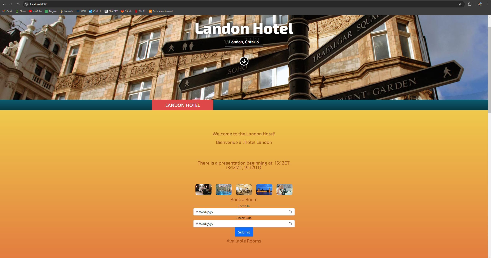
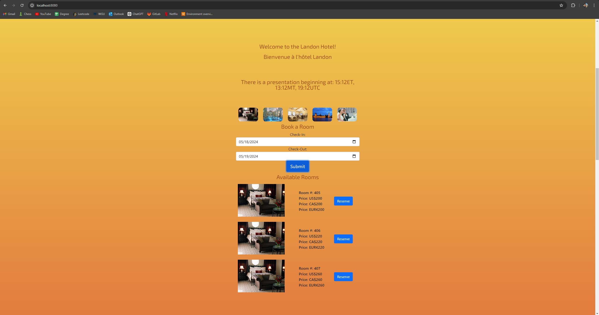
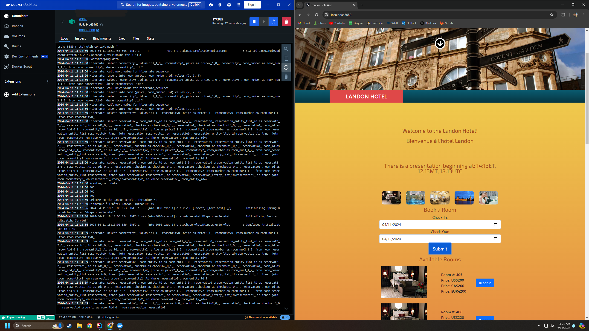

# Multi-Threaded Application

The Landon Hotel Scheduling Application is designed to enhance the internationalization and localization capabilities of the hotel reservation system. The application supports multilingual welcome messages and displays prices in various currencies. Additionally, it provides time zone conversions for an online live presentation.

## Features
### Localization and Internationalization
1. **Welcome Message in Multiple Languages**
    - Built resource bundles for English and French.
    - Displayed welcome messages using separate threads for each language.

2. **Currency Display**
    - Modified the front end to show reservation prices in U.S. dollars ($), Canadian dollars (C$), and euros (€).

3. **Time Zone Conversion**
    - Created a Java method to convert times between Eastern Time (ET), Mountain Time (MT), and Coordinated Universal Time (UTC).
    - Displayed the time for an online live presentation in all three time zones.

### Deployment
1. **Docker**
    - Built a Dockerfile to create a single image including all code modifications.
    - Created a Docker image of the multithreaded Spring application.
    - Ran the Docker image in a container.

